# Sistema de copias de seguridad

### Implementar un sistema de copias de seguridad para las instancias del cloud, teniendo en cuenta las siguientes características:

-----------------------------------------------------------------------------------------------------------------------------------------

     • Selecciona una aplicación para realizar el proceso: bacula, amanda, shell script con tar, rsync, dar, afio, etc.
     • Utiliza una de las instancias como servidor de copias de seguridad, añadiéndole un volumen y almacenando localmente las copias de seguridad que consideres adecuadas en él.
     • El proceso debe realizarse de forma completamente automática
     • Selecciona qué información es necesaria guardar (listado de paquetes, ficheros de configuración, documentos, datos, etc.)
     • Realiza semanalmente una copia completa
     • Realiza diariamente una copia incremental o diferencial (decidir cual es más adecuada)
     • Implementa una planificación del almacenamiento de copias de seguridad para una ejecución prevista de varios años, detallando qué copias completas se almacenarán de forma permanente y cuales se irán borrando
     • Selecciona un directorio de datos "críticos" que deberá almacenarse cifrado en la copia de seguridad, bien encargándote de hacer la copia manualmente o incluyendo la contraseña de cifrado en el sistema
     • Incluye en la copia los datos de las nuevas aplicaciones que se vayan instalando durante el resto del curso
     • Utiliza una ubicación secundaria para almacenar las copias de seguridad. Solicita acceso o la instalación de las aplicaciones que sean precisas.
     La corrección consistirá tanto en la restauración puntual de un fichero en cualquier fecha como la restauración completa de una de las instancias la última semana de curso.

-----------------------------------------------------------------------------------------------------------------------------------------

## 1. Selección de una aplicación para realizar el proceso.

-----------------------------------------------------------------------------------------------------------------------------------------

Para esta práctica he dicidido utilizar Bacula.

**¿Por qué he utilizado Bacula?**

Bacula es un software de código abierto que permite realizar copias de seguridad de forma automática y centralizada. Es un software modular, por lo que cada módulo se puede instalar en un servidor diferente, lo que permite ahorrar simultáneamente en diferentes medios de almacenamiento (por ejemplo de nas y cintas, al mismo tiempo y en diferentes ubicaciones físicas), para guardar el contenido de los servidores en diferentes lugDelta (lan, hosting o en la nube) y sistemas operativos heterogéneos, y al mismo tiempo mantener el control centralizado de todo.

**Características de Bacula:**

- **Multiplataforma**: Bacula puede realizar respaldos de estaciones de trabajo y servidores tanto de plataformas GNU/Linux, Windows y Mac OS.
    
- **Niveles de respaldo**: Bacula cumple con los estándDelta de respaldo de la información, lo cual permite generar backups completos, incrementales y diferenciales.
    
- **Multisoporte**: Bacula puede realizar respaldos en todo tipo de soportes tales como librerías de cintas o cabinas de discos.
    
- **Soporte VSS en Windows**: Permite realizar copias de archivos aunque estos estén en uso

**Componentes de Bacula:**

- **Director**: Es el programa que supervisa todas las operaciones relacionadas con las copias de seguridad, restauración, verificación y archivado. El administrador usa el “Director” para programar las copias de seguridad y recuperar ficheros. Funciona como un “demonio”, es decir, en segundo plano.

- **Console**: Es el programa que permite al administrador de sistemas comunicarse con el director. Generalmente se usa la consola de comandos, aunque también existen aplicaciones gráficas tanto en Windows como en Linux.

- **File**: También conocido como el programa del cliente, es el software que debe ser instalado y configurado en el lado del cliente. Este software proporcionará al Director la información que necesite para realizar sus operaciones, y es por tanto, dependiente del sistema operativo que use el cliente.

- **Storage**: Es el software que se encarga de realizar el almacenamiento y recuperación de ficheros en los dispositivos de almacenamiento donde se alacenen dichas copias de seguridad. Funciona como un “demonio” en la máquina donde está dicho(s) dispositivo(s) de almacenamiento.

- **Catalog**: Hace referencia al software que se encargará de mantener los índices de los ficheros y las bases de datos de los volúmenes, es decir, hace referencia al sistema gestor de base de datos en el que se apoya Bacula. Actualmente permite hacer uso de MariaDB/MySQL y PostgreSQL.

- **Monitor**: Es el programa que usa el administrador para ver el estado actual de los directores y los demonios del “Bacula Storage” y “Bacula File”. Actualmente solo hay disponible una herramienta gráfica que funciona con GNOME, KDE, etc.

-----------------------------------------------------------------------------------------------------------------------------------------

## 2. Detalles a tener en cuenta.

-----------------------------------------------------------------------------------------------------------------------------------------

Para esta práctica tenemos cuatro máquinas (Alfa, Bravo, Charlie y Delta). En la máquina Delta instalaremos el servidor de copias de seguridad, y en las otras tres máquinas (Bravo, Charlie y Alfa) instalaremos el cliente de copias de seguridad.

Así pues deberemos añadir un nuevo volumen a la máquina Delta. He estimado que el volumen debería tener unos 30 GB, ya que vamos a hacer copias de seguridad de las 4 máquinas: Alfa (que contine dos contenedores Delta y Charlie) que pesa alrededor de 6 GB, y Bravo que pesa alrededor de 3 GB.

La razón por la que he decidido crear un volumen con tanto espacio es por una sencilla cuestión de seguridad. Si por ejemplo, en un futuro, decidimos añadir una nueva máquina a la red, y queremos hacer copias de seguridad de esta nueva máquina, no tendremos que preocuparnos de si el volumen tiene espacio suficiente para almacenar las copias de seguridad de esta nueva máquina.

También debemos tener en cuenta de que en una situación real, deberemos tener en cuenta el almacenamiento a largo plazo. Ya que vamos a realizar muchísimas copias de seguridad y muchas serán muy parecidad entre sí o directamente iguales, por lo que deberemos tener en cuenta que el volumen no se llene de copias de seguridad que no vamos a utilizar. 

Por lo tanto deberemos guardar permanentemente solo aquellas copias de seguridad que se realizaron tras una implementación de un nuevo servicio en el escenario, tras una actualización de un servicio ya existente o modificaciones en el mismo. 

Por ejemplo, veo coherente la idea de realizar un backup trimestral que se guarde permanentemente, ya que así podremos tener una copia de seguridad de todas las máquinas en un momento determinado.


-----------------------------------------------------------------------------------------------------------------------------------------

## 3. Configuracion del servidor de copias de seguridad.

-----------------------------------------------------------------------------------------------------------------------------------------

Para empezar una vez que hemos creado el volumen y asociado a Delta, instalaremos los paquetes necesario en Delta para poder hacer copias de seguridad. Para ello ejecutaremos los siguientes comandos:
```bash
apt install bacula bacula-common-mysql bacula-director-mysql
```

Durante la instalación nos aparece el siguiente mensaje, eligiremos usar MariaDB/MySQL como gestor de base de datos:

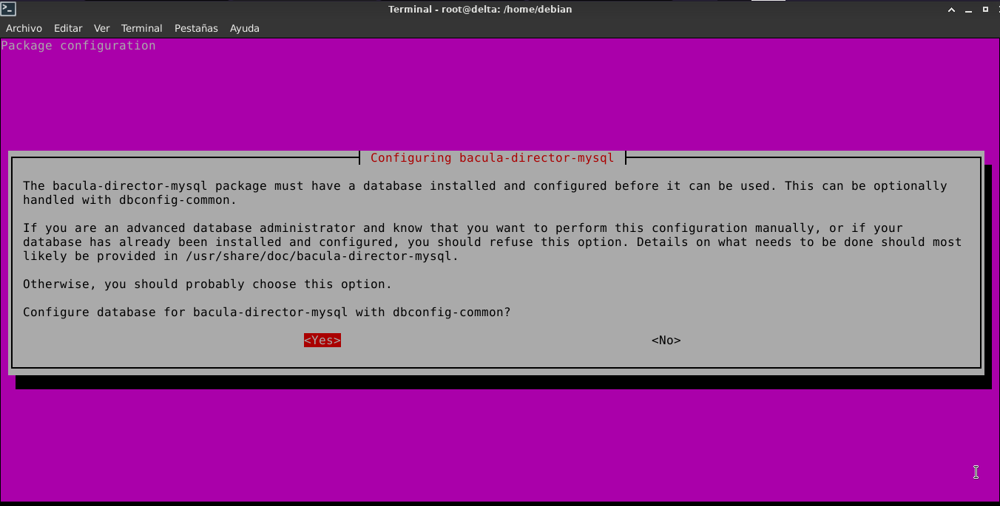

Luego deberemos establecer una contraseña para el usuario de la base de datos:

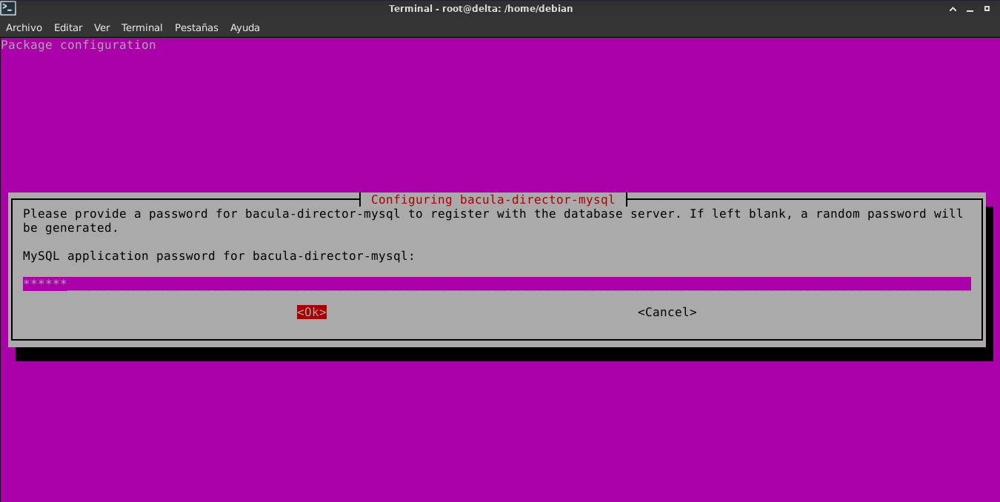

Acto seguido deberemos configurar Delta como director de Bacula, para ello vamos a modificar el fichero de configuración ubicado en /etc/bacula/bacula-dir.conf. En este fichero hay varios bloques de información, por lo que vamos a ir definiendo un poco cada uno:
```bash
nano /etc/bacula/bacula-dir.conf

Director {                             
  Name = delta-dir                                               ## El nombre del director.
  DIRport = 9101                                                ## El puerto que usará bacula (9101 por defecto).              
  QueryFile = "/etc/bacula/scripts/query.sql"                   ## Ruta del fichero de consulta.
  WorkingDirectory = "/var/lib/bacula"                          ## Directorio de trabajo donde el director almacena sus ficheros de estado.
  PidDirectory = "/run/bacula"                                  ## Directorio donde se almacena fichero con información del PID del director.
  Maximum Concurrent Jobs = 20                                  ## Número total de trabajos que el Director puede ejecutar de forma concurrente.
  Password = "bacula"                                             ## Contraseña del director.                  
  Messages = Daemon                                             
  DirAddress = 192.168.0.3                                    ## Dirección IP del director.
}
```

Luego nos iremos al segundo bloque de información, que es el que se encarga de definir los trabajos que se van a realizar:
```bash
JobDefs {
  Name = "DefaultJob"                                          ## Nombre del trabajo por defecto.
  Type = Backup                                                ## Tipo de trabajo.
  Level = Incremental                                          ## Nivel de trabajo.
  Client = delta-fd                                             ## Cliente al que se le va a realizar el trabajo.
  FileSet = "Full Set"                                         ## Conjunto de ficheros que se van a copiar.
  Schedule = "WeeklyCycle"                                     ## Programación del trabajo.
  Storage = File1                                              ## Almacenamiento del trabajo.
  Messages = Standard                                          ## Mensajes del trabajo.
  Pool = File                                                  ## Indica el “pool” de volúmenes en el que se almacenarán las copias.
  SpoolAttributes = yes                                        ## Indica si se deben almacenar los atributos de los ficheros.
  Priority = 10                                                ## Prioridad del trabajo.
  Write Bootstrap = "/var/lib/bacula/%c.bsr"                   ## Fichero de arranque.
}
```

Este bloque es el predeterminado que tenemos, pero debemos configurarlo para cada tipo de copia (diaria, semanal y mensual). Así que para ello vamos a definir tres bloques (el bloque de ejemplo que hemos visto antes lo vamos a dejar comentado):
```bash
JobDefs {
  Name = "Copia-Diaria"
  Type = Backup
  Level = Incremental
  Client = delta-fd
  FileSet = "Full Set"
  Schedule = "Diario"
  Storage = Almacenamiento
  Messages = Standard
  Pool = Diario
  SpoolAttributes = yes
  Priority = 10
  Write Bootstrap = "/var/lib/bacula/%c.bsr"
}

JobDefs {
  Name = "Copia-Semanal"
  Type = Backup
  Level = Full
  Client = delta-fd
  FileSet = "Full Set"
  Schedule = "Semanal"
  Storage = Almacenamiento
  Messages = Standard
  Pool = Semanal
  SpoolAttributes = yes
  Priority = 10
  Write Bootstrap = "/var/lib/bacula/%c.bsr"
}

JobDefs {
  Name = "Copia-Mensual"
  Type = Backup
  Level = Full
  Client = delta-fd
  FileSet = "Full Set"
  Schedule = "Mensual"
  Storage = Almacenamiento
  Messages = Standard
  Pool = Mensual
  SpoolAttributes = yes
  Priority = 10
  Write Bootstrap = "/var/lib/bacula/%c.bsr"
}
```

Tras definar las plantillas de los trabajos, vamos a definir los trabajos que se van a realizar. Para ello vamos a definir tres bloques de información por cada cliente:
```bash
# Alfa
Job {
  Name = "Alfa-Diario"
  Client = "alfa-fd"
  JobDefs = "Copia-Diaria"
  FileSet= "Alfa-Datos"
}

Job {
  Name = "Alfa-Semanal"
  Client = "alfa-fd"
  JobDefs = "Copia-Semanal"
  FileSet= "Alfa-Datos"
}

Job {
  Name = "Alfa-Mensual"
  Client = "alfa-fd"
  JobDefs = "Copia-Mensual"
  FileSet= "Alfa-Datos"
}

# Bravo
Job {
  Name = "Bravo-Diario"
  Client = "bravo-fd"
  JobDefs = "Copia-Diaria"
  FileSet= "Bravo-Datos"
}

Job {
  Name = "Bravo-Semanal"
  Client = "bravo-fd"
  JobDefs = "Copia-Semanal"
  FileSet= "Bravo-Datos"
}

Job {
  Name = "Bravo-Mensual"
  Client = "bravo-fd"
  JobDefs = "Copia-Mensual"
  FileSet= "Bravo-Datos"
}

# Charlie
Job {
  Name = "Charlie-Diario"
  Client = "charlie-fd"
  JobDefs = "Copia-Diaria"
  FileSet= "Charlie-Datos"
}

Job {
  Name = "Charlie-Semanal"
  Client = "charlie-fd"
  JobDefs = "Copia-Semanal"
  FileSet= "Charlie-Datos"
}

Job {
  Name = "Charlie-Mensual"
  Client = "charlie-fd"
  JobDefs = "Copia-Mensual"
  FileSet= "Charlie-Datos"
}

# Delta
Job {
  Name = "Delta-Diario"
  Client = "delta-fd"
  JobDefs = "Copia-Diaria"
  FileSet= "Delta-Datos"
}

Job {
  Name = "Delta-Semanal"
  Client = "delta-fd"
  JobDefs = "Copia-Semanal"
  FileSet= "Delta-Datos"
}

Job {
  Name = "Delta-Mensual"
  Client = "delta-fd"
  JobDefs = "Copia-Mensual"
  FileSet= "Delta-Datos"
}
```

Tras haber configurado esto, pasaremos a configurar los trabajos para la realización de las restauraciones. Para ello, vamos a definir un bloque de información por cada cliente nuevamente:
```bash

# Alfa
Job {
  Name = "Alfa-Restore"
  Type = Restore
  Client=alfa-fd
  Storage = Almacenamiento
  FileSet="Alfa-Datos"
  Pool = Backup-Restore
  Messages = Standard
}

# Bravo
Job {
  Name = "Bravo-Restore"
  Type = Restore
  Client=bravo-fd
  Storage = Almacenamiento
  FileSet="Bravo-Datos"
  Pool = Backup-Restore
  Messages = Standard
}

# Charlie
Job {
  Name = "Charlie-Restore"
  Type = Restore
  Client=charlie-fd
  Storage = Almacenamiento
  FileSet="Charlie-Datos"
  Pool = Backup-Restore
  Messages = Standard
}

# Delta
Job {
  Name = "Delta-Restore"
  Type = Restore
  Client=delta-fd
  Storage = Almacenamiento
  FileSet="Delta-Datos"
  Pool = Backup-Restore
  Messages = Standard
}
```

Seguiremos trabajando con el mismo fichero. Ahora definiremos los bloques de información que harán referencia a los datos que se van a copiar. Para ello, vamos a definir un bloque de información por cada cliente y un bloque de información general. También he decidido comprimir los datos con GZIP (para ahorrar espacio y tiempo) y firmarlos con MD5(para asegurarnos de que los datos no se han modificado durante la copia). 
```bash
# Full Set
FileSet {
 Name = "Full Set"
 Include {
   Options {
     signature = MD5
     compression = GZIP
   }
   File = /home
   File = /etc
   File = /var
   File = /usr/share
 }
 Exclude {
    File = /var/lib/bacula
    File = /nonexistant/path/to/file/archive/dir
    File = /proc
    File = /etc/fstab
    File = /var/run/systemd/generator
    File = /tmp
    File = /sys
    File = /.journal
    File = /.fsck
  }
}

# Alfa
FileSet {
 Name = "Alfa-Datos"
 Include {
   Options {
     signature = MD5
     compression = GZIP
   }
   File = /home
   File = /etc
   File = /var
   File = /usr/share
 }
 Exclude {
   File = /var/lib/bacula
   File = /nonexistant/path/to/file/archive/dir
   File = /proc
   File = /etc/fstab
   File = /var/run/systemd/generator
   File = /var/cache
   File = /var/tmp
   File = /tmp
   File = /sys
   File = /.journal
   File = /.fsck
 }
}

# Bravo (no he excluido /var/cache ya que Bravo tiene los datos de la pagina web guardados ahí)
FileSet {
 Name = "Bravo-Datos"
 Include {
   Options {
     signature = MD5
     compression = GZIP
   }
   File = /home
   File = /etc
   File = /var
   File = /usr/share
 }
 Exclude {
   File = /var/lib/bacula
   File = /nonexistant/path/to/file/archive/dir
   File = /proc
   File = /etc/fstab
   File = /var/run/systemd/generator
   File = /var/tmp
   File = /tmp
   File = /sys
   File = /.journal
   File = /.fsck
 }
}

# Charlie (no he excluido /var/cache ya que Charlie tiene los datos del dns guardados ahí)
FileSet {
 Name = "Charlie-Datos"
 Include {
   Options {
     signature = MD5
     compression = GZIP
   }
   File = /home
   File = /etc
   File = /var
   File = /opt
   File = /usr/share
 }
 Exclude {
   File = /var/lib/bacula
   File = /nonexistant/path/to/file/archive/dir
   File = /proc
   File = /etc/fstab
   File = /var/run/systemd/generator
   File = /var/tmp
   File = /tmp
   File = /sys
   File = /.journal
   File = /.fsck
 }
}

# Delta
FileSet {
 Name = "Delta-Datos"
 Include {
   Options {
     signature = MD5
     compression = GZIP
   }
   File = /home
   File = /etc
   File = /var
   File = /opt
   File = /usr/share
 }
 Exclude {
   File = /nonexistant/path/to/file/archive/dir
   File = /proc
   File = /var/cache
   File = /var/tmp
   File = /etc/fstab
   File = /var/run/systemd/generator
   File = /tmp
   File = /sys
   File = /.journal
   File = /.fsck
 }
}
```

Anteriormente, hicimos referencia a los bloques Schedule cuando definimos los Jobs o trabajos que se iban a realizar. Ahora vamos a definir dichos bloques los cuales nos permitirán programar las copias de seguridad de forma automática.
```bash
Schedule {
 Name = "Diario"
 Run = Level=Incremental Pool=Diario daily at 10:00
}

Schedule {
 Name = "Semanal"
 Run = Level=Full Pool=Semanal mon at 10:00
}

Schedule {
 Name = "Mensual"
 Run = Level=Full Pool=Mensual 1st mon at 10:00
}
```

También vamos a tener que definir los bloques de información que harán referencia a los datos propios de cada cliente. Para ello, vamos a definir un bloque de información por cada cliente.
```bash
# Alfa
Client {
 Name = alfa-fd                         # Nombre del cliente (por defecto añaade -fd al final del nombre)
 Address = 192.168.0.1              # Dirección IP del cliente     
 FDPort = 9102                          # Puerto por el que se comunica con el cliente
 Catalog = MyCatalog                    # Nombre del catálogo que se va a utilizar
 Password = "bacula"                      # Contraseña del cliente
 File Retention = 60 days               # Tiempo que se van a conservar los datos de los ficheros en el catálogo
 Job Retention = 6 months               # Tiempo que se van a conservar los registros de los Jobs en el catálogo
 AutoPrune = yes                        # Si se va a realizar una limpieza automática de los datos del catálogo pasado el tiempo indicado antes
}

# Bravo
Client {
 Name = bravo-fd
 Address = 172.16.0.200
 FDPort = 9102
 Catalog = MyCatalog
 Password = "bacula"
 File Retention = 60 days
 Job Retention = 6 months
 AutoPrune = yes
}

# Charlie
Client {
 Name = charlie-fd
 Address = 192.168.0.2
 FDPort = 9102
 Catalog = MyCatalog
 Password = "bacula"
 File Retention = 60 days
 Job Retention = 6 months
 AutoPrune = yes
}

# Delta
Client {
 Name = delta-fd
 Address = 192.168.0.3
 FDPort = 9102
 Catalog = MyCatalog
 Password = "bacula"
 File Retention = 60 days
 Job Retention = 6 months
 AutoPrune = yes
}
```

El siguiente bloque que vamos a definir es el del Storage. Este bloque nos permitirá definir la información de los dispositivos de almacenamiento que vamos a utilizar para guardar las copias de seguridad. En nuestro caso, vamos a definir un único dispositivo de almacenamiento.
```bash
Storage {
 Name = Almacenamiento                      # Nombre del dispositivo de almacenamiento
 Address = 192.168.0.3                  # Dirección IP del dispositivo de almacenamiento
 SDPort = 9103                              # Puerto por el que se comunica con el dispositivo de almacenamiento
 Password = "bacula"                          # Contraseña del dispositivo de almacenamiento
 Device = FileChgr1                         # Nombre del dispositivo de almacenamiento
 Media Type = File                          # Tipo de dispositivo de almacenamiento
 Maximum Concurrent Jobs = 10               # Número máximo de trabajos que se pueden ejecutar en paralelo
}
```

Luego tendremos que definir el bloque Catalog. Este bloque nos permitirá definir la información del catálogo que vamos a utilizar para guardar la información de las copias de seguridad.
```bash
Catalog {
  Name = MyCatalog
  dbname = "bacula"; DB Address = "localhost"; DB Port= "3306"; dbuser = "bacula"; dbpassword = "bacula"
}
```

El último bloque que vamos a definir en el fichero será el del Pool. Este bloque nos permitirá definir la información de los Pools que vamos a utilizar para guardar las copias de seguridad. En nuestro caso, vamos a definir los siguientes Pools:
```bash
Pool {
 Name = Diario                       # Nombre del Pool
 Pool Type = Backup                  # Tipo de Pool
 Recycle = yes                       # Si se va a reciclar el Pool
 AutoPrune = yes                     # Si se va a realizar una limpieza automática de los datos del Pool pasado el tiempo indicado antes
 Volume Retention = 8d               # Tiempo que se van a conservar los volúmenes en el Pool
}

Pool {
 Name = Semanal
 Pool Type = Backup
 Recycle = yes
 AutoPrune = yes
 Volume Retention = 32d
}

Pool {
 Name = Mensual
 Pool Type = Backup
 Recycle = yes
 AutoPrune = yes
 Volume Retention = 365d
}

Pool {
 Name = Backup-Restore
 Pool Type = Backup
 Recycle = yes
 AutoPrune = yes
 Volume Retention = 366 days
 Maximum Volume Bytes = 50G           # Tamaño máximo de los volúmenes 
 Maximum Volumes = 100                # Número máximo de volúmenes
 Label Format = "Remoto"              # Etiqueta que se va a utilizar para los volúmenes
}
```

Por fin habríamos terminado de definir todos los bloques de información que necesitamos para configurar el servidor de Bacula. Ahora vamos a guardar el fichero de configuración y vamos a comprobar que no hay ningún error en la sintaxis del mismo.
```bash
bacula-dir -tc /etc/bacula/bacula-dir.conf
```

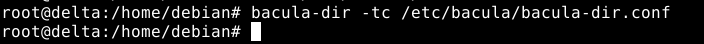

Ahora particionaremos y formatearemos el volumen que anexamos al servidor de Bacula para poder utilizarlo como dispositivo de almacenamiento.
```bash
lsblk -f
```

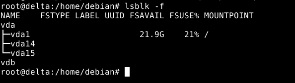

Crearé una única partición en el disco duro (el particionado lo tuve que hacer desde Alfa, ya que desde Delta me daba un error):
```bash
gdisk /dev/vdb
```

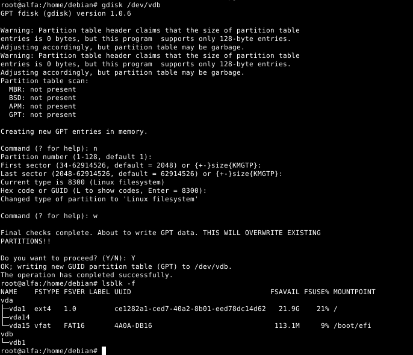

Formatearé la partición en Btrfs ya que es un sistema de ficheros que comprime automáticamente los datos y que tratará de corregir cualquier corrupción de datos que pueda sufrir el disco duro, además de muchas otras ventajas.
```bash
apt install btrfs-progs
mkfs.btrfs /dev/vdb1
```

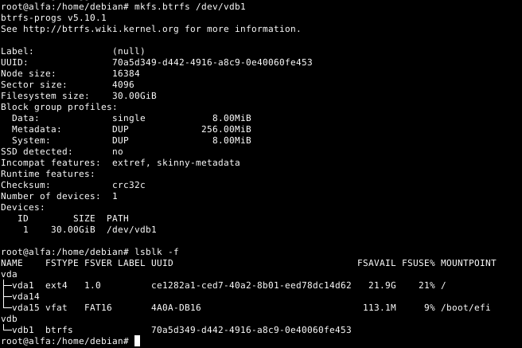

Ahora podremos proceder a crear una unidad de systemd para montar el dispositivo de almacenamiento automáticamente cada vez que se reinicie el servidor de Bacula.
```bash
mkdir -p /bacula
chown -R bacula:bacula /bacula/
chmod 755 -R /bacula
```

Este proceso anterior deberemos hacerlo en Alfa y Delta. El motivo es que Delta es un contenedor de Alfa, y el volumen está montado en Alfa ya que en Delta no se puede montar un volumen al ser un contenedor. 

Las unidades de systemd que vamos a crear serán las siguiente:
```bash
nano /etc/systemd/system/bacula.mount

# En el servidor Alfa
[Unit]
Description=script de montaje NFS
Requires=networking.service
After=networking.service
[Mount]
What=/dev/vdb1
Where=/bacula
Type=btrfs
Options=defaults,compress=zlib

[Install]
WantedBy=multi-user.target

# En el cliente Delta
[Unit]
Description=Volumen de copias de seguridad   
Requires=network-online.target
After=network-online.target

[Mount]
What=192.168.0.1:/bacula
Where=/bacula  
Type=nfs
Options=_netdev,auto

[Install]
WantedBy=multi-user.target
```

Deberemos activar la unidad de systemd y reiniciar el servidor para que se monte el dispositivo de almacenamiento.
```bash
systemctl daemon-reload
systemctl enable bacula.mount
systemctl restart bacula.mount
systemctl status bacula.mount
```
En Alfa:

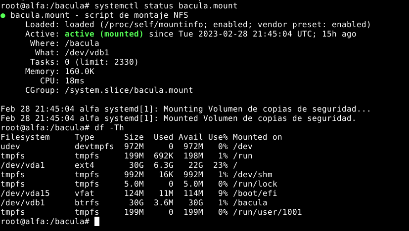

En Delta:

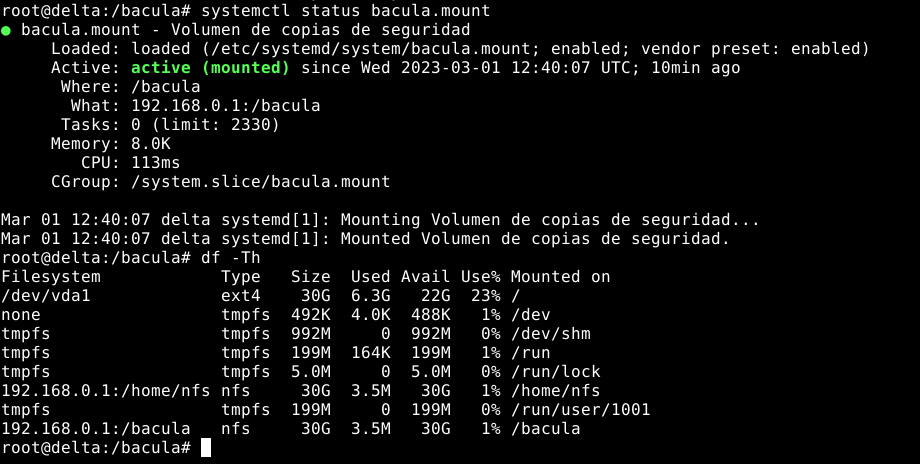

Recuerdo que para compartir un recurso por NFS en Alfa, deberemos editar el fichero /etc/exports y añadir la siguiente línea:
```bash
/bacula                192.168.0.3/24(rw,sync,fsid=0,subtree_check,no_all_squas>
```

Tras esto, deberemos exportar el recurso y reiniciar el servicio de NFS.
```bash
exportfs -arvs
systemctl restart nfs-kernel-server
```

Ahora vamos a crear el directorio donde se van a guardar las copias de seguridad de los clientes.
```bash
mkdir -p /bacula/backup
chown -R bacula:bacula /bacula/
chmod 755 -R /bacula
```

Ya habríamos terminado de configurar el volumen de almacenamiento junto a sus directorios. Ahora vamos a proceder a configurar el almacenamiento en el servidor de Bacula. Para ello, vamos a editar el fichero de configuración /etc/bacula/bacula-sd.conf y crearemos los siguientes bloques de información:
```bash
Storage {
  Name = delta-sd                         # Nombre del director de Bacula
  SDPort = 9103                           # Puerto por el que se comunica con el director de Bacula
  WorkingDirectory = "/var/lib/bacula"    # Directorio de trabajo
  Pid Directory = "/run/bacula"           # Directorio donde se guardan los PIDs
  Plugin Directory = "/usr/lib/bacula"    # Directorio donde se guardan los plugins
  Maximum Concurrent Jobs = 20            # Número máximo de trabajos que se pueden ejecutar en paralelo
  SDAddress = 192.168.0.3               # Dirección IP del director de Bacula
}

Director {
  Name = delta-dir                        # Nombre del director de Bacula autorizado para ejecutar el demonio de almacenamiento          
  Password = "bacula"
}

Director {
  Name = delta-mon                        # Nombre del director de Bacula autorizado para monitorizar el almacenamiento 
  Password = "bacula"
  Monitor = yes
}

Autochanger {
  Name = FileChgr1                        # Nombre del del cargador automático
  Device = FileStorage                    # Nombre del dispositivo de almacenamiento        
  Changer Command = ""                    # Comando que se va a ejecutar para cambiar el volumen
  Changer Device = /dev/null              # Dispositivo que se va a utilizar para cambiar el volumen
}

Device {
  Name = FileStorage                        # Nombre del dispositivo de almacenamiento
  Media Type = File                         # Tipo de dispositivo de almacenamiento
  Archive Device = /bacula/backup           # Directorio donde se van a guardar las copias de seguridad
  LabelMedia = yes;                         # Si se va a etiquetar el volumen
  Random Access = Yes;                      # Si se va a acceder de forma aleatoria al volumen
  AutomaticMount = yes;                     # Si se va a montar el volumen automáticamente
  RemovableMedia = no;                      # Si el volumen es extraíble
  AlwaysOpen = no;                          # Si se va a abrir el volumen siempre que se ejecute un trabajo
  Maximum Concurrent Jobs = 5               # Número máximo de trabajos que se pueden ejecutar en paralelo
}
```

Ya hemos terminado de configurar este fichero, para comprobar que no hay ningún error en la sintaxis del mismo, ejecutaremos el siguiente comando:
```bash
bacula-sd -tc /etc/bacula/bacula-sd.conf
```

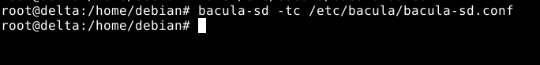

Ya podremos reiniciar y habilitar los servicios de Bacula para que se apliquen los cambios.
```bash
systemctl restart bacula-sd.service
systemctl enable bacula-sd.service
systemctl restart bacula-director.service
systemctl enable bacula-director.service
systemctl status bacula-sd.service
systemctl status bacula-director.service
```

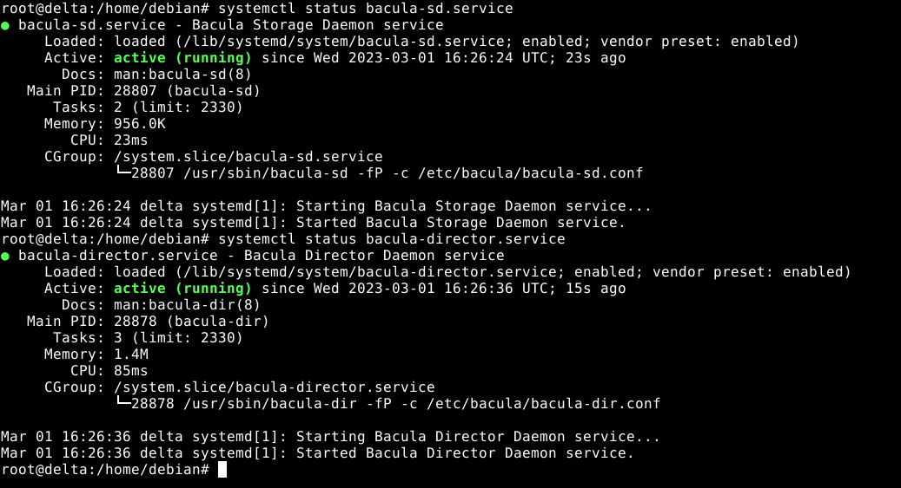

Aún no hemos terminado de configurar el servidor de Bacula, ya que nos falta configurar un último fichero: /etc/bacula/bconsole.conf. En este fichero vamos a definir la configuración para acceder al director de Bacula desde la consola de Bacula. Para ello, vamos a crear el siguiente bloque de información:
```bash
Director {
  Name = delta-dir
  DIRport = 9101
  address = 192.168.0.3
  Password = "bacula"
}
```

Ya habríamos terminado de configurar el servidor de Bacula. Ahora vamos configurar los clientes de Bacula.

-----------------------------------------------------------------------------------------------------------------------------------------

## 4. Configuración de los clientes.

-----------------------------------------------------------------------------------------------------------------------------------------

### Cliente Delta.

Delta es a la vez director y cliente, lo único que haremos será crear su fichero de configuración de cliente. De esta forma, empezamos por instalar el sofware necesario (que Delta ya lo tiene por ser el director):
```bash
apt install bacula-client
```

Habilitamos el servicio para que arranque en cada inicio:
```bash
systemctl enable bacula-fd.service
```

Ahora configuraremos el cliente en el fichero /etc/bacula/bacula-fd.conf:
```bash
Director {
  Name = delta-dir
  Password = "bacula"
}

Director {
  Name = delta-mon
  Password = "bacula"
  Monitor = yes
}

FileDaemon {
  Name = delta-fd
  FDport = 9102
  WorkingDirectory = /var/lib/bacula
  Pid Directory = /run/bacula
  Maximum Concurrent Jobs = 20
  Plugin Directory = /usr/lib/bacula
  FDAddress = 192.168.0.3
}

Messages {
  Name = Standard
  director = delta-dir = all, !skipped, !restored
}
```

Reiniciamos el servico para aplicar los cambios y habríamos terminado con este cliente:
```bash
systemctl restart bacula-fd.service
systemctl status bacula-fd.service
```

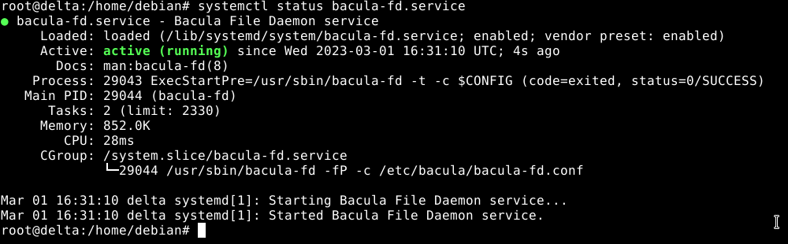

### Cliente Alfa.

Procederemos a instalar el software necesario en el cliente Alfa:
```bash
apt install bacula-client
```

Habilitamos el servicio para que arranque en cada inicio:
```bash
systemctl enable bacula-fd.service
```

Configuramos el cliente en el fichero /etc/bacula/bacula-fd.conf:
```bash
Director {
  Name = delta-dir
  Password = "bacula"
}

Director {
  Name = delta-mon
  Password = "bacula"
  Monitor = yes
}

FileDaemon {
  Name = alfa-fd
  FDport = 9102
  WorkingDirectory = /var/lib/bacula
  Pid Directory = /run/bacula
  Maximum Concurrent Jobs = 20
  Plugin Directory = /usr/lib/bacula
  FDAddress = 192.168.0.1
}

Messages {
  Name = Standard
  director = delta-dir = all, !skipped, !restored
}
```

Reiniciamos el servico para aplicar los cambios y habríamos terminado con este cliente:
```bash
systemctl restart bacula-fd.service
systemctl status bacula-fd.service
```

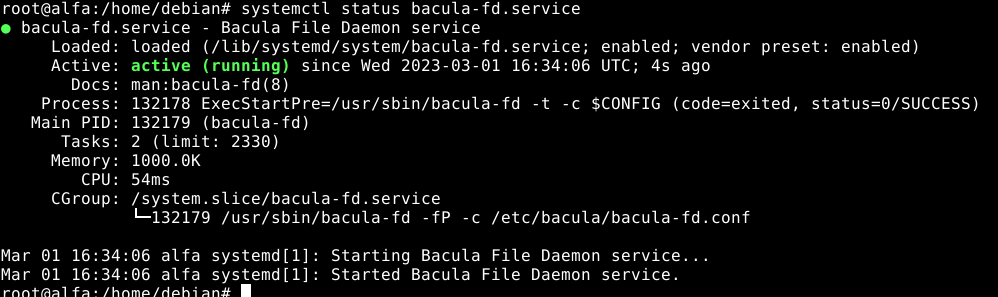

### Cliente Charlie.

Procederemos a instalar el software necesario en el cliente Charlie:
```bash
apt install bacula-client
```

Habilitamos el servicio para que arranque en cada inicio:
```bash
systemctl enable bacula-fd.service
```

Configuramos el cliente en el fichero /etc/bacula/bacula-fd.conf:
```bash
Director {
  Name = delta-dir
  Password = "bacula"
}

Director {
  Name = delta-mon
  Password = "bacula"
  Monitor = yes
}

FileDaemon {
  Name = charlie-fd
  FDport = 9102
  WorkingDirectory = /var/lib/bacula
  Pid Directory = /run/bacula
  Maximum Concurrent Jobs = 20
  Plugin Directory = /usr/lib/bacula
  FDAddress = 192.168.0.2
}

Messages {
  Name = Standard
  director = delta-dir = all, !skipped, !restored
}
```

Reiniciamos el servico para aplicar los cambios y habríamos terminado con este cliente:
```bash
systemctl restart bacula-fd.service
systemctl status bacula-fd.service
```

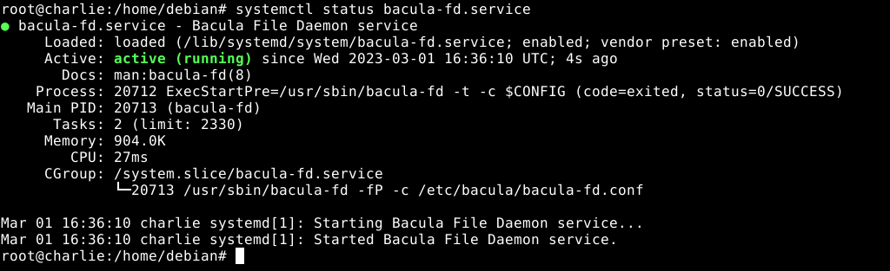

### Cliente Bravo.

Procederemos a instalar el software necesario en el cliente Bravo:
```bash
dnf install bacula-client
```

Habilitamos el servicio para que arranque en cada inicio:
```bash
systemctl enable bacula-fd.service
```

Configuramos el cliente en el fichero /etc/bacula/bacula-fd.conf:
```bash
Director {
  Name = delta-dir
  Password = "bacula"
}

Director {
  Name = delta-mon
  Password = "bacula"
  Monitor = yes
}

FileDaemon {
  Name = bravo-fd
  FDport = 9102
  WorkingDirectory = /var/spool/bacula
  Pid Directory = /var/run
  Maximum Concurrent Jobs = 20
  Plugin Directory = /usr/lib64/bacula
  FDAddress = 172.16.0.200
}

Messages {
  Name = Standard
  director = delta-dir = all, !skipped, !restored
}
```

Deberemos habilitar los puertos 9101, 9102 y 9103 en el cortafuegos de la máquina Bravo, ya que al ser una máquina Rocky Linux, tiene un cortafuegos activo por defecto:
```bash
firewall-cmd --permanent --add-port=9101/tcp
firewall-cmd --permanent --add-port=9102/tcp
firewall-cmd --permanent --add-port=9103/tcp
firewall-cmd --reload
```

Antes de ejecutar estos comandos, en mi caso tuve que descargar el paquete firewalld y habilitarlo:
```bash
dnf install firewalld
systemctl enable firewalld
systemctl start firewalld
```

Reiniciamos el servico para aplicar los cambios y habríamos terminado con este cliente:
```bash
systemctl restart bacula-fd.service
systemctl status bacula-fd.service
```

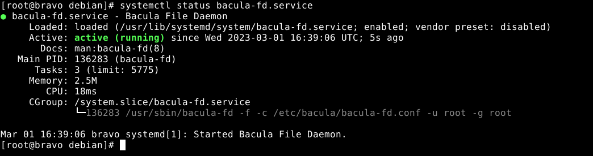


-----------------------------------------------------------------------------------------------------------------------------------------

## 5. Pruebas de funcionamiento.

-----------------------------------------------------------------------------------------------------------------------------------------

### Conexión con los clientes.

Reiniciamos los servicios del servidor:
```bash
systemctl restart bacula-fd.service
systemctl restart bacula-sd.service
systemctl restart bacula-director.service
```

Para comprobar que los clientes se han conectado correctamente, nos conectamos al director y desde la consola de Bacula ejecutamos el comando:
```bash
bconsole
status client
```

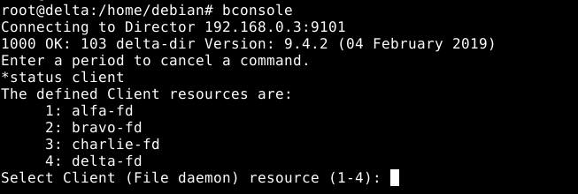

Alfa:

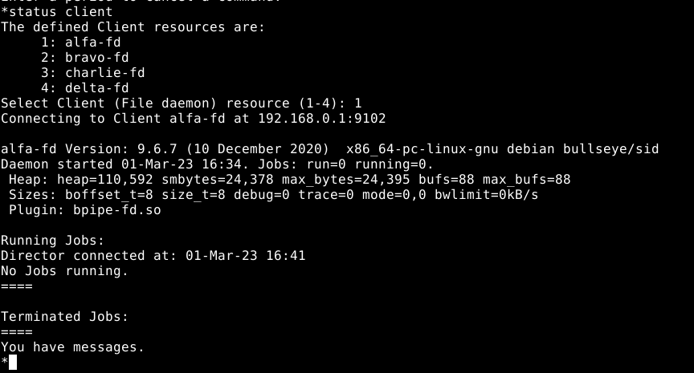

Bravo:


Charlie:

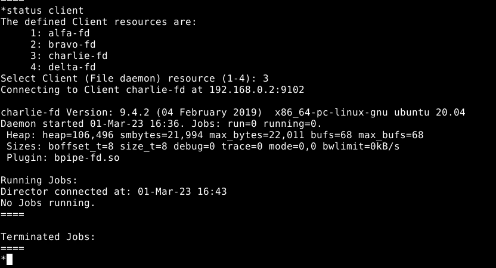

Delta:

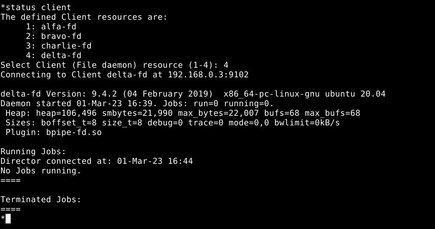

¡Perfecto, hemos podido establecer conexión con todos los clientes!

### Creación de nodos de almacenamiento donde se guardaran los diferentes backups.

Para crear los nodos de almacenamiento, nos conectamos al director y desde la consola de Bacula ejecutamos el comando:
```bash
bconsole
label
```

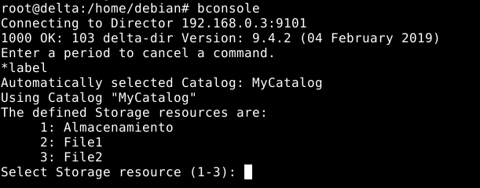

Creamos el nodo de almacenamiento para el backup diario:

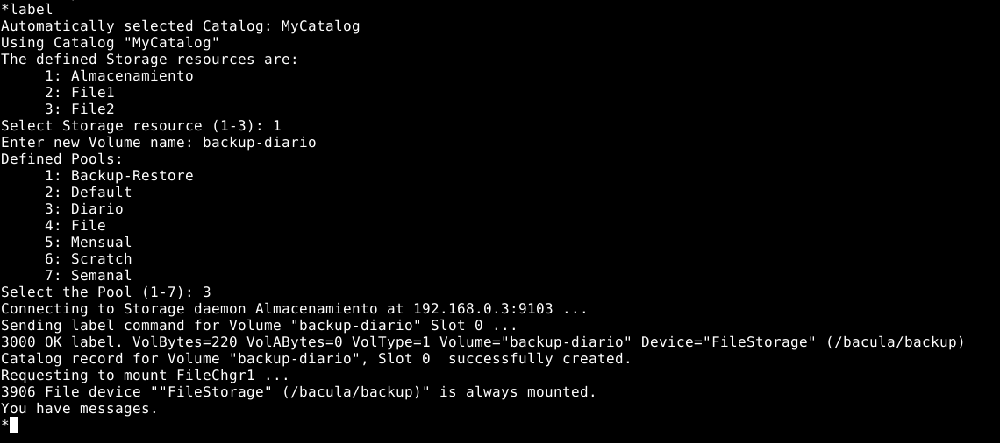

Creamos el nodo de almacenamiento para el backup semanal:

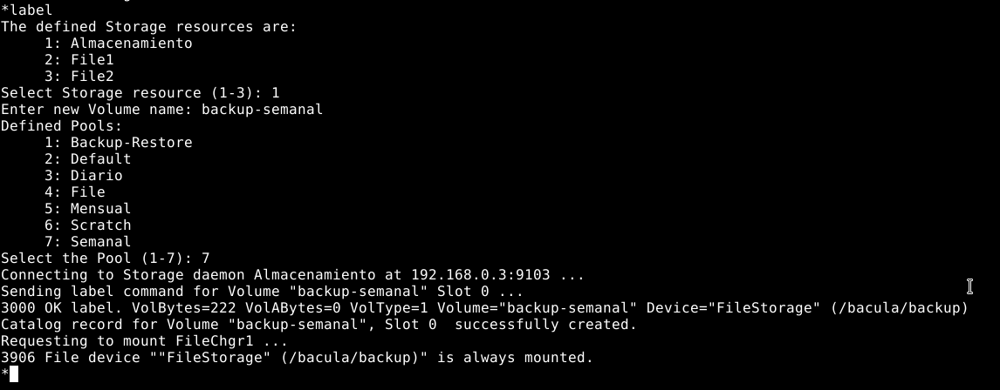

Creamos el nodo de almacenamiento para el backup mensual:

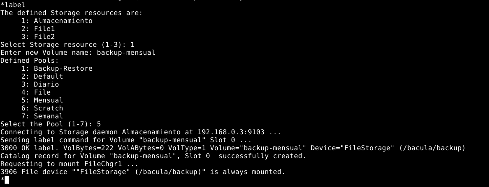

### Ver copias de seguridad.

Para ver las copias de seguridad, nos conectamos al director y desde la consola de Bacula ejecutamos el comando:
```bash
bconsole
list jobs
```

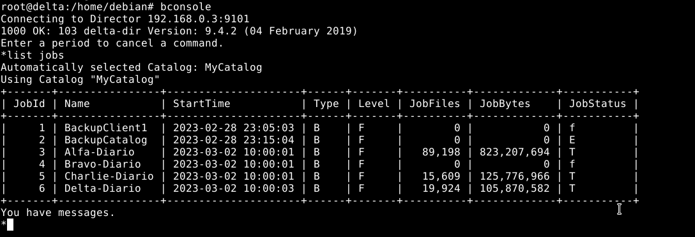

Deberemos esperar a que se realicen los backups para poder ver los resultados.

En los nuestro buzon podremos ver que bacula nos ha mandado información sobre los backups realizados.

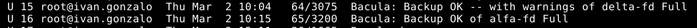
-
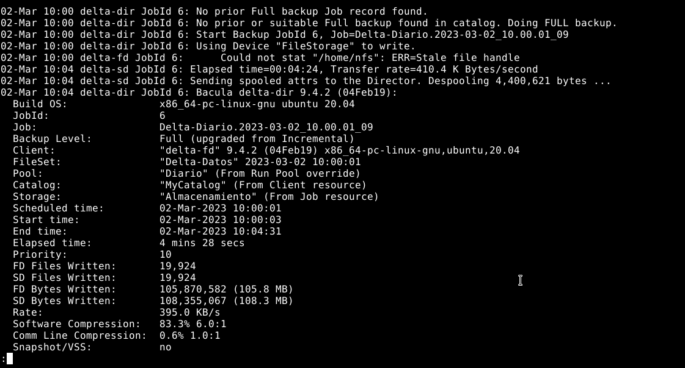

### Realizar copias de seguridad de un archivo cifrado.

Me dirigiré a la máquina Alfa y crearé un directorio y un archivo para realizar la copia de seguridad:
```bash
mkdir /home/debian/Cifrado
touch /home/debian/Cifrado/Secreto.txt
```

Para cifrar el archivo, ejecutaremos el siguiente comando:
```bash
gpgtar --encrypt --symmetric --output /home/debian/Cifrado/Secreto.txt.gpg --gpg-args="--passphrase=secreto --batch" /home/debian/Cifrado/Secreto.txt
```

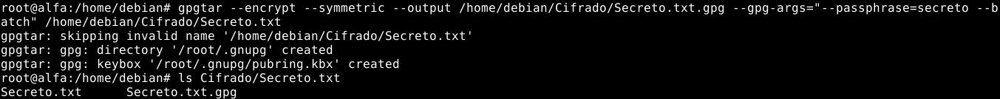

Para desencriptar el archivo, ejecutaremos el siguiente comando:
```bash
mkdir Cifrado
gpgtar --decrypt --output --directory Cifrado --gpg-args="--passphrase=secreto --batch" Secreto.txt.gpg
```

Esta forma sería algo rudimentaria, ya que con bacula podremos cifrar los datos de forma automática. No los cifrará el bacula-sd o el bacula-director, sino que es en origen, es decir, se cifrarán en bacula-fd. 

Primero generaremos las claves de cifrado que necesitamos para hacer el cifrado de datos. Para ello, generamos la clave maestra:
```bash
openssl genrsa -out master.key 2048
openssl req -new \
       -key master.key \
       -x509 \
       -out master.cert \
       -days 3650
```

En este caso, y para evitar futuros problemas, creamos un certificado con 10 años de validez. Este será nuestro certificado maestro.
Ahora debemos de generar el par de claves para cada cliente. Este es el paso que debemos de repetir en cada uno de los clientes.
```bash
openssl genrsa -out client.key 2048
openssl req -new \
       -key client.key \
       -x509 \
       -out client.cert \
       -days 3650
cat client.key client.cert > client.pem
```

Y ahora, ya únicamente nos queda por editar el fichero del agente (bacula-fd.conf) y añadir las claves de cifrado en el apartado FileDaemon.
```bash
FileDaemon {
   ...
   # Data Encryption
   PKI Signatures = Yes
   PKI Encryption = Yes
   PKI Keypair = "/etc/bacula/tls/client.pem"
   PKI Master Key = "/etc/bacula/tls/master.cert"
}
```

Tras el cambio, reiniciamos el daemon y podemos lanzar una tarea de backup:
```bash
systemctl restart bacula-fd.service
```

Todo el proceso de copia y restauración de backups en el cliente es completamente transparente para el administrador. Es el propio software de Bacula quien lo realiza.


-----------------------------------------------------------------------------------------------------------------------------------------

### Realizar una restauración a partir de una copia de seguridad.

Para ello vamos a utilizar la consola de Bacula, nos conectamos al director y desde la consola de Bacula ejecutamos el comando:
```bash
bconsole
restore client=charlie-fd all
```

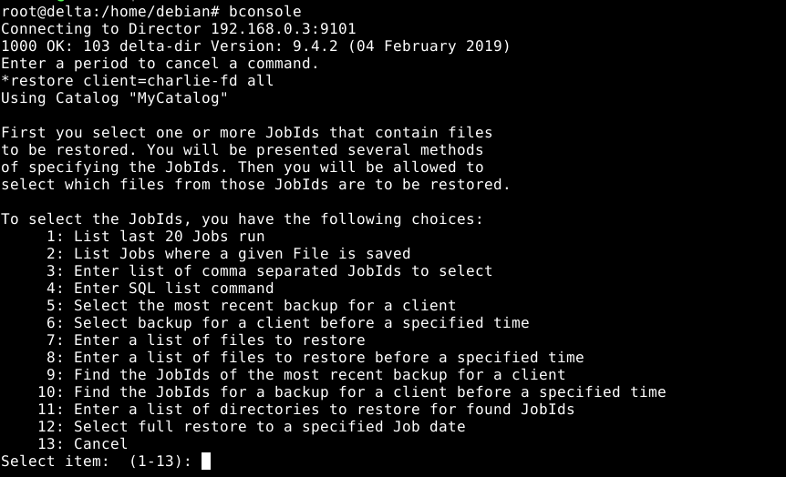

He decidido realizar la restauración de todos los archivos de Charlie. La opción que más nos conviene a nosotros si queremos restaurar la versión más reciente de la máquina en caso de que la máquina origen se haya dañado, es la opción 5.

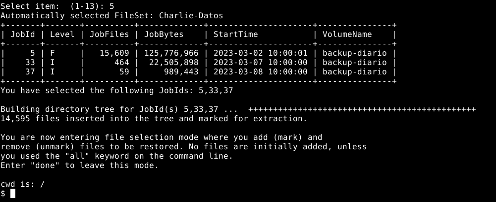

Lo siguiente que haremos será elegir el Job de recuperación que queremos realizar, en este caso, el Job de recuperación de Charlie.

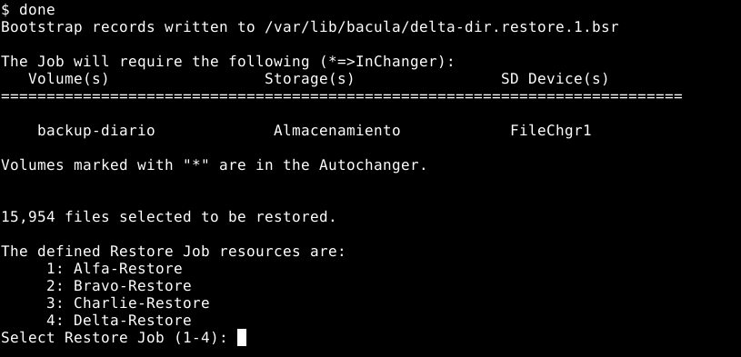

Le indicamos que comience y entonces ya solo nos quedará esperar a que se termine de realizar la restauración.

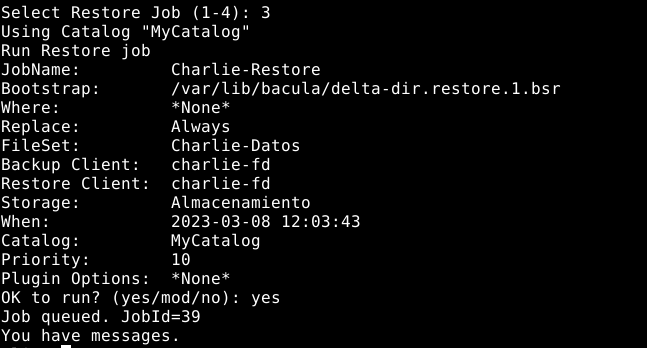

-

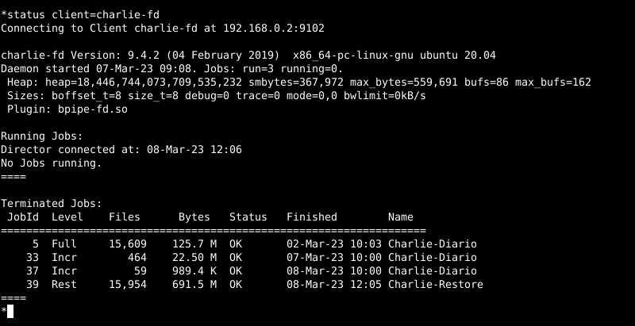

Una vez finalizada la restauración, nos conectaremos a la máquina Charlie y comprobaremos que se ha restaurado correctamente. Para ello reinstalaremos todos los paquetes que teníamos instalados en la máquina original:
```bash
apt reinstall ~i
```

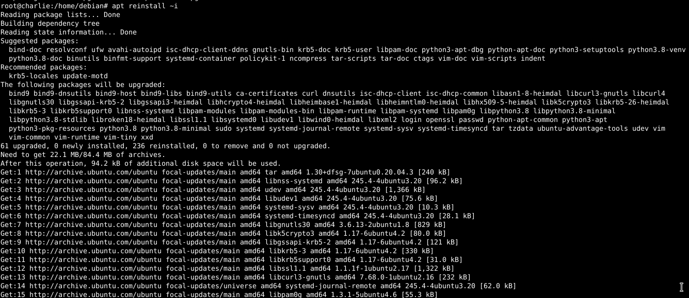

En caso de que fuera Bravo (Rocky Linux), ejecutaríamos el siguiente comando:
```bash
dnf reinstall \*
```

Esperaremos a que se reinstalen todos los paquetes, y tras esto podremos reinciar la máquina y comprobar que se ha restaurado correctamente.

Voy a comprobar que se ha restaurado correctamente haciendo uso del servicio de LDAP:
```bash
su - prueba
```

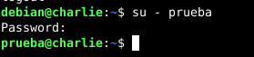

Y desde alfa haré una consulta DNS ya que Charlie es el servidor de DNS:
```bash
dig charlie.ivan.gonzalonazareno.org
```

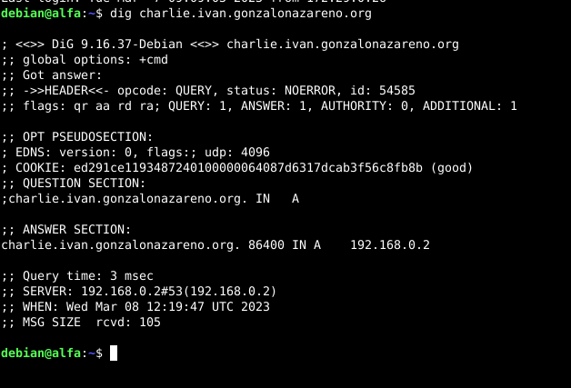

Voy a comprobar que desde la bconsole Delta sigue teniendo conexión con Charlie:
```bash
status client=charlie-fd
```

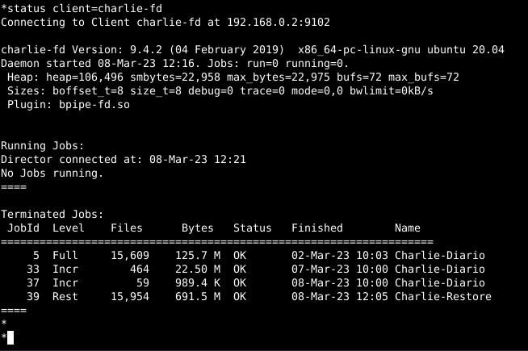
